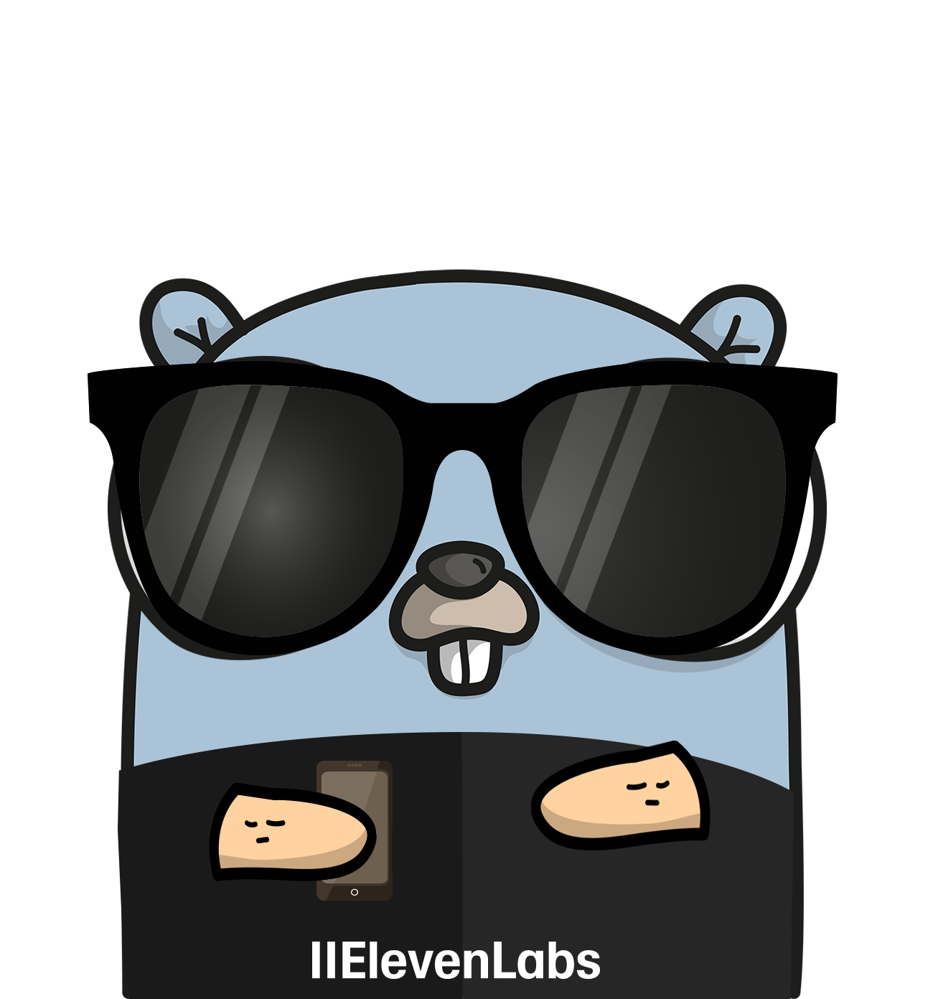

<br/>
<p align="center">
  <a href="https://github.com/yzaimoglu/elevenlabs-go">
    
  </a>

  <h3 align="center">ElevenLabs Go Client</h3>

  <p align="center">
    Unofficial Go Client for the ElevenLabs API
    <br/>
    <br/>
    <a href="https://github.com/yzaimoglu/elevenlabs-go/issues">Report Bug</a>
    .
    <a href="https://github.com/yzaimoglu/elevenlabs-go/issues">Request Feature</a>
  </p>
</p>

   

# ElevenLabs Go Client
A Go client for interacting with the [ElevenLabs API](https://api.elevenlabs.io/), providing easy-to-use methods for the endpoints for Administration, Conversational AI and advanced features like TTS, STT and other ElevenLabs features.

## Features
This project is currently work in progress and not all of the endpoints are supported.
- [ ] **Administration**
- [ ] **Conversational AI**
- [ ] **Text to Speech**
- [ ] **Speech to Text**
- [ ] **Text to Dialogue**
- [ ] **Voice Changer**
- [ ] **Sound Effects**
- [ ] **Audio Isolation**
- [ ] **Text to Voice**
- [ ] **Dubbing**
- [ ] **Audio Native**
- [ ] **Voices**
- [ ] **Forced Alignment**

## Installation
```bash
go get github.com/yzaimoglu/elevenlabs-go
```

## Usage
```go
package main

import (
    "fmt"
    "log"

    elevenlabs "github.com/yzaimoglu/elevenlabs-go"
)

func main() {
	// Create a new ElevenLabs API client
    // The Environment can either be EnvironmentProduction, EnvironmentProductionUS, EnvironmentProductionEU or EnvironmentProductionIndia
	client, err := elevenlabs.NewClient("<YOUR_API_KEY>", elevenlabs.EnvironmentProductionEU)
	if err != nil {
		log.Fatalf("Failed to create client: %v", err)
	}

    // Use a method that calls the API (Listing all Conversational AI agents here)
    agents, err := client.ConversationalAI.Agents.ListAgents()
    if err != nil {
        log.Fatalf("Error fetching agents: %v", err)
    }

    for _, a := range agents {
        fmt.Printf("Agent Name: %s (ID: %s)\n", a.Name, a.AgentId)
    }
}
```

## Documentation
Full API documentation:
- [Elevenlabs API Reference](https://elevenlabs.io/docs/api-reference/introduction)

This client aims to be a 1:1 wrapper for the official ElevenLabs API endpoints.
Refer to the code and GoDoc for detailed usage examples.

## Contributing
1. Fork the repository
2. Create a feature branch: git checkout -b feat/my-feature
3. Commit changes: git commit -m 'Add my feature'
4. Push to branch: git push origin feat/my-feature
5. Create a Pull Request

## License
[BSD-3 License](https://github.com/yzaimoglu/elevenlabs-go/blob/main/LICENSE)

## Acknowledgments
- This project is heavily inspired by the structure of the [unofficial Zendesk Go Client](https://github.com/nukosuke/go-zendesk) by nukosuke.
- Gopher created with [Gopherize](https://gopherize.me/)